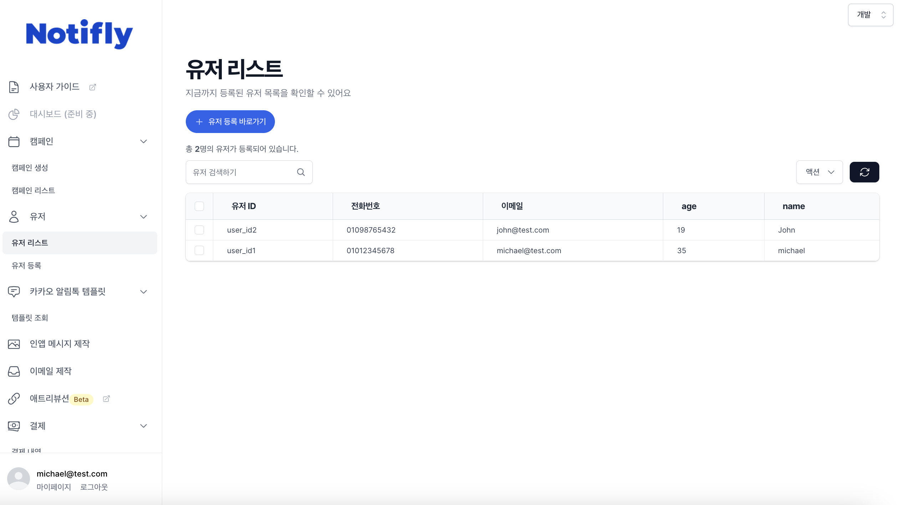
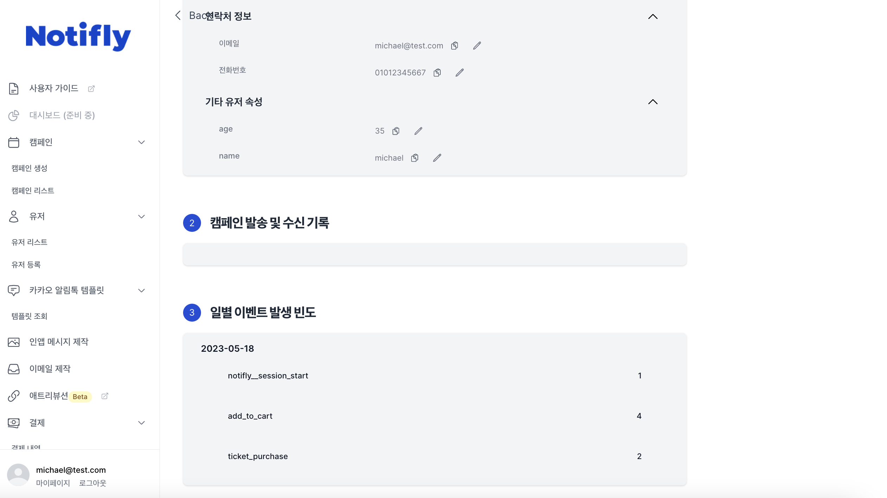
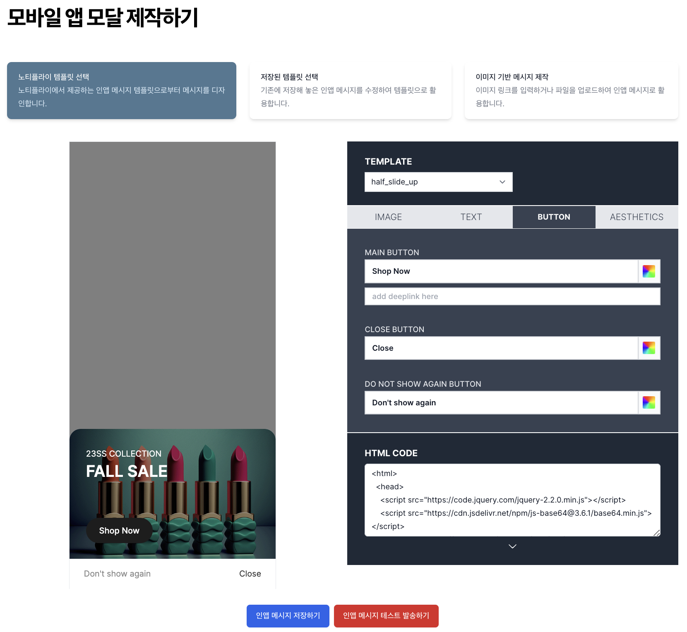
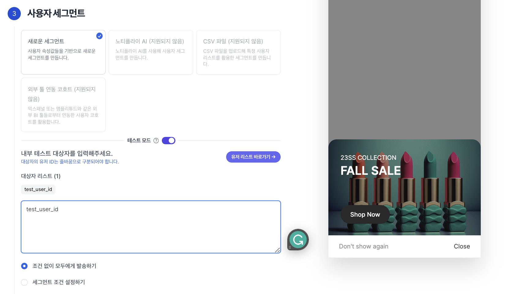
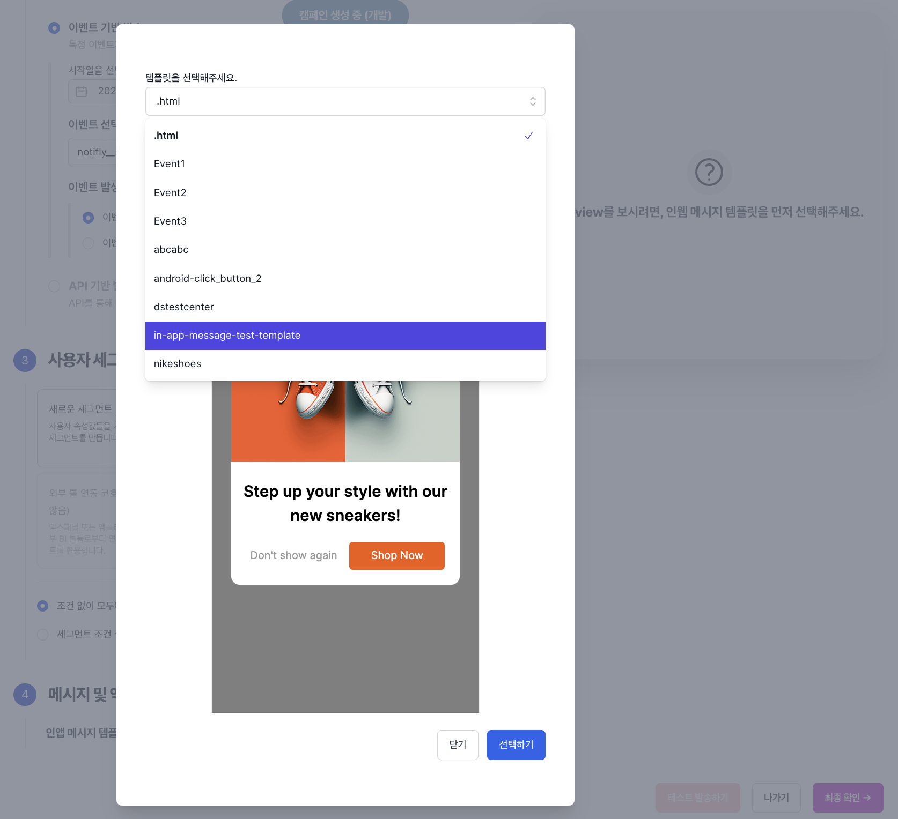
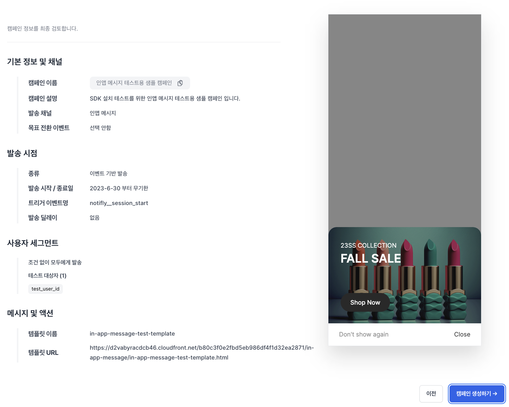
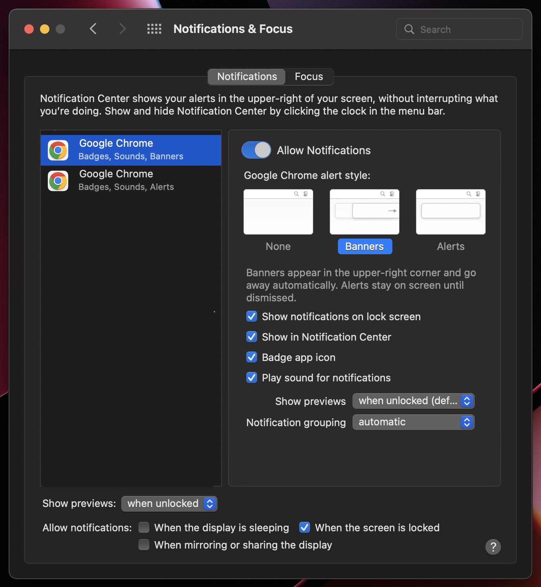
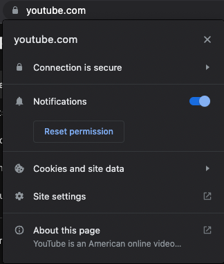
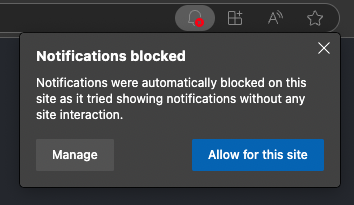

본 섹션에서는 Notifly Client SDK가 정상적으로 연동되었는지 확인하는 테스트 절차를 안내합니다.

## 1. 유저 등록 및 이벤트 전송

### 1-1. 유저 아이디 등록

- 유저 ID를 등록하지 않아도 유저는 자동 생성됩니다. 하지만 userId를 지정해야 동일 유저를 식별할 수 있습니다.
- Notifly SDK의 setUserId를 이용해 유저를 등록합니다.

### 1-2. 유저 프로퍼티 등록

- Notifly SDK의 setUserProperties를 이용해 유저의 속성 정보를 등록합니다.

### 1-3. 이벤트 전송

- Notifly SDK의 trackEvent를 이용해 유저의 행동(페이지 진입, 클릭 등)을 이벤트로 전송합니다.

## 2. 유저 및 이벤트 등록 확인

1. [노티플라이 홈페이지](https://notifly.tech/)에 로그인
2. 오른쪽 상단에서 테스트 유저가 등록된 프로젝트(개발/프로덕션 중 선택) 확인
3. 유저 메뉴 → 유저 리스트로 이동
4. 테스트 유저 클릭 → 유저 프로필 페이지에서 다음 항목 확인
    - 유저 아이디 등록 여부
    - 유저 프로퍼티 ($email, $phone_number 등) 정상 반영 여부
    - 이벤트 로그 정상 수신 여부

**유저 리스트 예시**

**유저 프로필 예시**

**이벤트 로그 예시**

## 3. 앱 푸시 알림 테스트

<Warning> iOS Simulator에서는 푸시 알림 테스트가 불가능합니다. 실제 기기에서 진행하세요. </Warning>

1. 콘솔에서 캠페인 생성 페이지로 이동

2. 오른쪽 상단 탭에서 테스트 유저가 등록된 프로젝트 선택

3. 기본 정보 및 채널 → `앱 푸시` 선택

4. 메시지 및 액션 → 푸시 메시지 작성
    - 메시지 제목: 푸시 알림의 제목
    - 메시지 내용: 푸시 알림의 본문
    - 액션: 클릭 시 이동할 URL 또는 딥링크 지정
        - Foreground / Background / Terminated 상태별로 클릭 동작 확인 필수

5. 우측 하단의 “테스트 발송하기” 클릭 → 테스트 유저 아이디 입력 → 발송

기기에서 정상적으로 푸시 알림이 도착했다면 테스트 완료입니다.

## 4. 인앱 팝업 테스트

Notifly는 기본적으로 `notifly__session_start` 등의 내부 이벤트를 자동 로깅합니다.
해당 이벤트를 기반으로 인앱 팝업이 정상적으로 표시되는지 테스트합니다.

### 4-1. 인앱 팝업 템플릿을 제작

1. 인앱 팝업 제작 페이지로 이동
2. 템플릿 선택 후 Image, Text, Button, Aesthetics 설정
   - Button 영역의 main_button 클릭 시 이동 링크는 필수 입력

3. 저장하기 → 템플릿 이름 입력 → 저장

### 4-2. 테스트 캠페인 생성

1. 캠페인 생성 페이지로 이동
2. 프로젝트 선택 (개발/프로덕션 중 테스트 유저가 포함된 프로젝트)
3. 기본 정보 및 채널 
   - 캠페인 이름 입력
   - 발송 채널 `인앱 팝업`을 선택
4. 발송 시점
   - 이벤트 기반 발송 선택
   - 무기한 발송 체크
   - 이벤트: `notifly__session_start` 입력
   - 발송 타이밍: “이벤트 발생 시 바로 발송”

5. 사용자 세그먼트
    - 테스트 모드 활성화 → 테스트 유저 ID 입력

6. 메시지 및 액션
    - 4-1에서 만든 테스트할 인앱 팝업 템플릿 선택

7. 최종 확인 → 캠페인 생성
   

### 4-3. 테스트 기기에서 팝업 확인

1. 테스트 유저 ID가 등록된 기기에서 앱 완전 종료 (Terminated 상태)

2. 앱 실행 → `notifly__session_start` 이벤트 발생

3. 인앱 팝업이 정상 표시되는지 확인

    - 새로 만든 캠페인의 동기화 지연으로 즉시 표시되지 않을 수 있습니다. 앱을 재실행해보세요.

팝업이 표시되면 인앱 기능 테스트 완료입니다.

## 5. 웹 푸시 알림 테스트

### 5-1. 테스트 발송

1. 콘솔에서 캠페인 생성 페이지로 이동

2. 오른쪽 상단 탭에서 테스트 유저가 등록된 프로젝트 선택

3. 기본 정보 및 채널 → `웹 푸시` 선택

4. 메시지 및 액션 → 푸시 메시지 작성
    - 메시지 제목: 푸시 알림의 제목
    - 메시지 내용: 푸시 알림의 본문
    - 액션: 클릭 시 이동할 웹페이지 또는 URL 지정
        - Foreground / Background 상태 모두 테스트

5. 우측 하단의 “테스트 발송하기” 클릭 → 테스트 유저 아이디 입력 → 발송

정상적으로 웹 푸시가 도착했다면 테스트 완료입니다.

### 5-2. 문제 해결

웹 푸시 알림이 정상적으로 도착하지 않는 가장 흔한 원인들에 대해 확인해보세요.

<Accordion title="기기 권한">

macOS/Windows 환경에서 브라우저 알림 권한이 허용되어야 합니다.

예시 (macOS):

</Accordion>
<Accordion title="브라우저 권한">

브라우저별 권한 요청 방식이 다르므로 알림 허용 상태를 확인하세요.

예시 (Chrome)

예시 (Edge)

Notifly JS SDK 설정에 따라 기본 권한 팝업이 자동 표시되지 않을 수 있습니다. 자세한 내용은 [JavaScript SDK - Service Worker 등록하기](sdk/javascript-sdk)를 참고해 주세요.
/>
</Accordion>
<Accordion title="브라우저 버전">
#### 브라우저 버전

Notifly는 Web Push Protocol을 기반으로 합니다. 지원 목록은 [Push API - Browser compatibility](https://developer.mozilla.org/en-US/docs/Web/API/Push_API)를 참고하세요.

> 예를 들어, 데스크탑에서 Safari 버전 15 이하에서는 웹 푸시가 지원되지 않습니다.
</Accordion>

다른 질문이 있으신가요? 노티플라이 팀에 문의해주세요.
