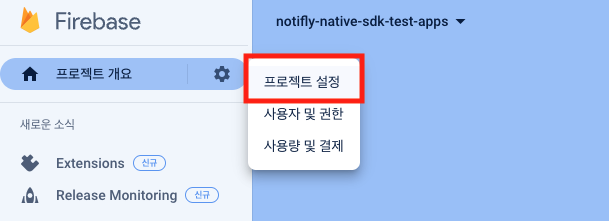
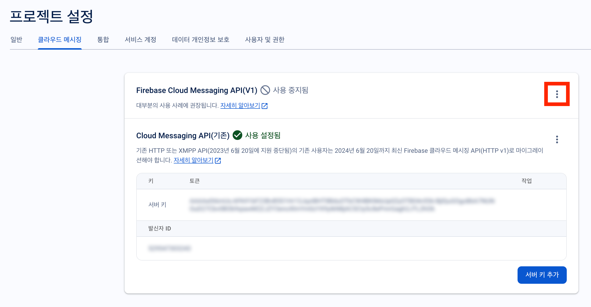
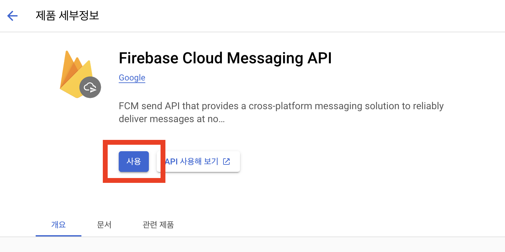
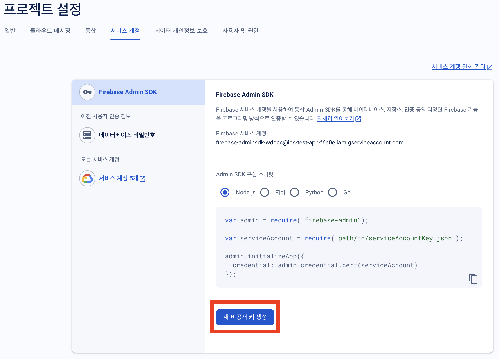
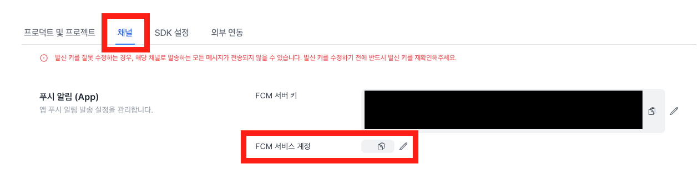

노티플라이에서는 푸시 알림과 인앱 팝업을 발송하기 위해 [Firebase Cloud Messaging](https://firebase.google.com/docs/cloud-messaging)을 활용하고 있습니다.

- Firebase Cloud Messaging을 활용하기 위해서는 Firebase 프로젝트가 필요합니다.
- Firebase 프로젝트를 생성하고, 노티플라이에 Firebase 프로젝트를 연동하는 방법을 안내합니다.

## 1. Prerequisite

### 1-1. Firebase 프로젝트 셋업

Firebase 프로젝트가 생성되어 있어야하며 앱이 이 프로젝트에 등록되어 있어야 합니다.

- Firebase 프로젝트 생성 방법은 [여기](https://firebase.google.com/docs/projects/learn-more?hl=ko)를 참고하세요.
- Firebase 프로젝트에 앱을 등록하는 방법은 [여기](https://firebase.google.com/docs/projects/learn-more?hl=ko#add-app)를 참고하세요.

### 1-2. 플랫폼별 Firebase 설정

<Tabs>
<Tab title="Flutter">
Flutter는 두 가지 방식으로 Firebase 설정을 진행할 수 있습니다.

1. **FlutterFire CLI를 통해 설치 및 초기화 (권장)**  
👉 [FlutterFire 가이드 보기](https://firebase.flutter.dev/docs/overview#installation)
2. **플랫폼(iOS, Android)별로 수동 설치 및 초기화**  
👉 [수동 설치 가이드 보기](https://firebase.flutter.dev/docs/manual-installation/)

두 가지 방식 모두 가능합니다.  
설치 후에는 다음 파일이 반드시 포함되어야 합니다:

- **Android:** `google-services.json`  
- **iOS:** `GoogleService-Info.plist`

</Tab>
<Tab title="React Native">

React Native는 Android와 iOS 각각에 대해 Firebase 설정이 필요합니다.  
아래 플랫폼별 탭(Android / iOS)을 참고하여 설정을 진행하세요.
> 💡 Android와 iOS 모두 Firebase 콘솔에서 앱을 등록해야 합니다.

</Tab>
<Tab title="Android">

Firebase 프로젝트에 등록된 앱의  
`google-services.json` 파일이 프로젝트에 추가되어 있어야 합니다.

- 파일 추가 방법: [Firebase 공식 문서 (Android)](https://firebase.google.com/docs/android/setup?hl=ko#add-config-file)

> ⚠️ `app/` 디렉토리 하위에 `google-services.json`을 추가해야 합니다.

</Tab>
<Tab title="iOS">

Firebase 프로젝트에 등록된 앱의  
`GoogleService-Info.plist` 파일이 프로젝트에 포함되어야 합니다.

- 파일 추가 방법: [Firebase 공식 문서 (iOS)](https://firebase.google.com/docs/ios/setup?hl=ko#add-config-file)

> ⚠️ Xcode의 프로젝트 루트에 `GoogleService-Info.plist`를 추가하고, 빌드 타겟에 포함되었는지 확인하세요.

</Tab>
</Tabs>

---

### 1-3. APNs 인증서 등록

iOS 앱(React Native, Flutter 포함)의 경우, **APNs 인증서**가 Firebase 프로젝트에 등록되어 있어야 합니다.

- [APNs 인증서 등록 가이드](https://firebase.google.com/docs/cloud-messaging/ios/client?hl=ko#upload_your_apns_authentication_key)

🔐 **Tip:** APNs 인증 키를 업로드해야 iOS 기기로 푸시 알림 전송이 가능합니다.

## 2. Firebase 프로젝트 Firebase Cloud Messaging API(V1) 활성화

Notifly를 통해 푸시 알림 및 인앱 팝업을 기기에 전송하기 위해서는 Firebase Cloud Messaging API(V1)가 활성화되어 있어야 합니다.
Firebase Cloud Messaging API(V1) 활성화 방법은 다음과 같습니다.

1. [Firebase 콘솔](https://console.firebase.google.com/)에 로그인합니다.
2. 좌측 상단 탭에서 `프로젝트 설정`을 선택합니다.

3. 클라우드 메시징 탭으로 이동합니다.
4. Firebase 클라우드 메시징 API(V1)가 활성화되었는지 확인합니다.
- 클라우드 메시징 API가 활성화되었다면, 이 단계는 완료되었습니다.
- 3으로 이동하여, FCM 서비스 계정을 노티플라이에 등록해주세요.
5. 클라우드 메시징 API가 비활성화되어 있다면, 우측 상단의 아이콘을 클릭해서 관리페이지로 이동합니다.

6. Google Cloud Console에서 Firebase Cloud Messaging API를 활성화합니다.

## 3. 노티플라이에 FCM 서비스 계정 등록

노티플라이와 Firebase Cloud Messaging (FCM) 연동을 위해서는 FCM 서비스 계정 키가 필요합니다. 이 키는 Firebase 프로젝트에서 생성 및 관리됩니다.

### FCM 서비스 계정 키 생성하기

1. Firebase 콘솔의 프로젝트에 접속하여 '서비스 계정' 탭으로 이동합니다.
2. '새 비공개 키 생성' 버튼을 클릭하여 새 서비스 계정 키를 생성합니다.

3. 팝업된 대화 상자에서 '키 생성' 버튼을 클릭하여 키를 생성합니다.

4. 생성된 JSON 키 파일이 다운로드됩니다. 이 파일은 노티플라이에 등록할 때 필요하니 안전한 곳에 보관하세요.

### 노티플라이 콘솔에 키 등록하기

1. 노티플라이 콘솔에 로그인한 뒤, 설정 페이지로 이동합니다.
2. '채널' 탭에서 다운로드한 JSON 파일의 내용을 복사하여 FCM 서비스 계정 키 입력란에 붙여넣기 합니다.

