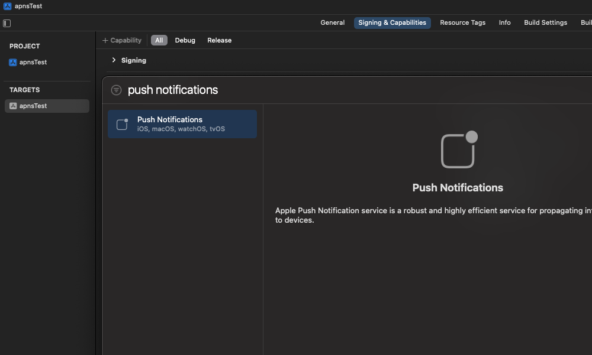
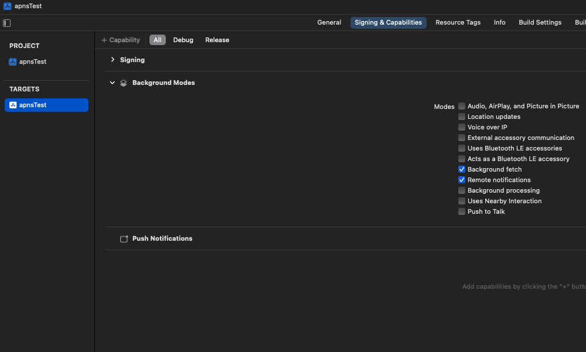
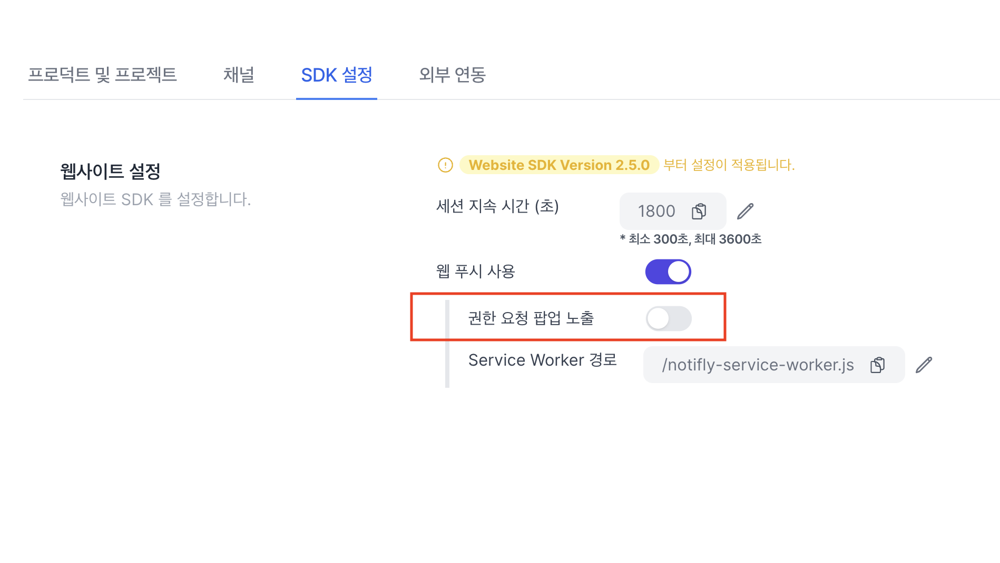
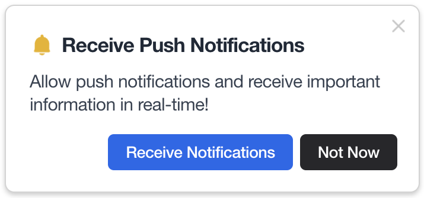

Notifly Flutter Plugin은 노티플라이의 푸시 및 인앱 캠페인 기능을 Flutter 앱에 통합할 수 있도록 지원합니다.

- 기기 정보를 노티플라이에 등록하여 **푸시 알림 및 인앱 팝업** 수신
  (인앱 팝업은 **Foreground 상태**에서만 표시됩니다)

- 이벤트 및 유저 정보를 노티플라이와 연동하여 캠페인 타깃팅 및 분석에 활용
- 유저 행동 기반의 이벤트 로깅 및 성과 측정

<Info> Android 인앱 팝업은 **Android 11(API 30) 이상**에서만 지원됩니다. </Info>

## Before You Start

SDK 설치 전, 아래를 먼저 완료하세요.

1. Firebase 프로젝트 연동
👉 sdk/firebase-integration(파이어베이스 프로젝트/앱 연결, FCM 설정 포함)

2. iOS APNs 인증 등록
👉 sdk/firebase-integration#ios-apns (APNs 인증 키/인증서 등록)

<Info> 권장 환경: iOS 13+ / Android 7.0(API 24)+. iOS는 반드시 **Runner.xcworkspace**로 빌드하세요. </Info>

## 1. 플러그인 셋업

### Plugin 설치

```bash
flutter pub add notifly_flutter
cd ios && pod install
```

`pubspec.yaml`에는 다음과 같이 추가됩니다. (현재 최신 버전: [](https://pub.dev/packages/notifly_flutter)

```yaml
dependencies:
  notifly_flutter: ^1.3.5
```

### iOS 설정

#### 1. Capability 설정

1. Xcode에서 `Runner.xcworkspace`을 엽니다. (`.xcodeproj`로는 노티플라이 SDK 사용 불가)

2. iOS Deployment Target/Target의 Minimum Deployments을 13.0 이상으로 설정하고, Podfile의 최소 버전도 동일하게 지정합니다.

3. Push Notification 및 Background Mode (Remote notification, Background fetch)를 활성화합니다.
   
   

#### 2. `AppDelegate.swift` 설정

1. 파일 위치

`AppDelegate.swift` 파일은 다음 경로에 있습니다:

```
ios/Runner/AppDelegate.mm
```

2. `notifly_sdk` import 추가

```dart
#import notifly_sdk
```

3. `AppDelegate.swift` 수정

`FlutterAppDelegate`의 관련 메서드를 override 하여 Notifly 연동 코드를 추가합니다.

| 메서드 이름 | 설명 |
|--------------|------|
| `application(_:didFinishLaunchingWithOptions:)` | UNNotificationCenter의 delegate를 self로 설정 |
| `application(_:didRegisterForRemoteNotificationsWithDeviceToken:)` | APNs 토큰을 Notifly에 등록 |
| `application(_:didFailToRegisterForRemoteNotificationsWithError:)` | APNs 등록 실패 시 Notifly에 알림 |
| `userNotificationCenter(_:didReceive:withCompletionHandler:)` | 푸시 알림 클릭 이벤트 전달 |
| `userNotificationCenter(_:willPresent:withCompletionHandler:)` | Foreground 상태의 푸시 표시 처리 |

<Tabs>
<Tab title="Swift">
```swift title="AppDelegate.swift"
import Flutter
import notifly_sdk
import UIKit

@UIApplicationMain
@objc class AppDelegate: FlutterAppDelegate {

    override func application(
        _ application: UIApplication,
        didFinishLaunchingWithOptions launchOptions: [UIApplication.LaunchOptionsKey: Any]?
    ) -> Bool {
        GeneratedPluginRegistrant.register(with: self)
        UNUserNotificationCenter.current().delegate = self
        return super.application(application, didFinishLaunchingWithOptions: launchOptions)
    }

    override func application(
        _ application: UIApplication,
        didFailToRegisterForRemoteNotificationsWithError error: Error
    ) {
        Notifly.application(application,
                            didFailToRegisterForRemoteNotificationsWithError: error)
        super.application(application, didFailToRegisterForRemoteNotificationsWithError: error)
    }

    override func application(
        _ application: UIApplication,
        didRegisterForRemoteNotificationsWithDeviceToken deviceToken: Data
    ) {
        Notifly.application(application,
                            didRegisterForRemoteNotificationsWithDeviceToken: deviceToken)
        super.application(application, didRegisterForRemoteNotificationsWithDeviceToken: deviceToken)
    }

    override func userNotificationCenter(_ notificationCenter: UNUserNotificationCenter,
                                        didReceive response: UNNotificationResponse,
                                        withCompletionHandler completion: @escaping () -> Void)
    {
        Notifly.userNotificationCenter(notificationCenter,
                                    didReceive: response)
        super.userNotificationCenter(notificationCenter, didReceive: response, withCompletionHandler: completion)
    }

    override func userNotificationCenter(_ notificationCenter: UNUserNotificationCenter,
                                        willPresent notification: UNNotification,
                                        withCompletionHandler completion: @escaping (UNNotificationPresentationOptions) -> Void)
    {
        Notifly.userNotificationCenter(notificationCenter,
                                    willPresent: notification,
                                    withCompletionHandler: completion)
        super.userNotificationCenter(notificationCenter, willPresent: notification, withCompletionHandler: completion)
    }
}
```
</Tab>
</Tabs>

### (권장) iOS Notification Service Extension 설정

<Info> `notifly-sdk` 버전 3.0.4 이상부터 지원됩니다. </Info>

Notification Service Extension을 설정하면 리치 푸시(Rich Push) 기능을 사용할 수 있습니다. Notifly의 [Push Extension 가이드](advanced/rich-push-notification)를 참고해 설정하세요.

#### 주요 기능

1. 푸시 알림에 이미지 및 비디오 첨부 가능
2. 유저의 푸시 수신 여부를 추적하여 캠페인 성과를 세부적으로 분석 가능

<Warning> Notification Service Extension 설정을 하지 않아도 SDK는 정상 동작하지만, 리치 푸시 및 수신 트래킹은 사용할 수 없습니다. </Warning>

### 초기화 코드 추가

앱 진입점(예: main.dart)에 Notifly Plugin 초기화 코드를 추가합니다.

환경변수`dotenv`등을 사용할 수 있습니다.

```dart title="main.dart"
import 'package:notifly_flutter/notifly_flutter.dart';

void main() async {
    WidgetsFlutterBinding.ensureInitialized();
    await NotiflyPlugin.initialize(
        projectId: dotenv.env['NOTIFLY_PROJECT_ID']!,
        username: dotenv.env['NOTIFLY_USERNAME']!,
        password: dotenv.env['NOTIFLY_PASSWORD']!,
    );
}
```

<Info> `NOTIFLY_PROJECT_ID`, `NOTIFLY_USERNAME`, `NOTIFLY_PASSWORD`는 Notifly 관리자 페이지에서 확인할 수 있습니다. </Info>

## 2. 유저 정보 등록

Notifly는 유저 식별자(`userId`)와 유저 프로퍼티(`params`)를 기반으로 개인화 마케팅 캠페인을 수행합니다.  
등록된 유저 정보는 세그먼트 분류, 푸시 발송, 이메일 및 카카오 알림톡 등의 타깃팅에 활용됩니다.

### 1. 유저 ID 등록 (`Notifly.setUserId()`)

`userId`는 앱 내부의 로그인 사용자 식별자와 매핑됩니다.  
Notifly는 이 값을 기준으로 사용자 이벤트를 추적하고 캠페인을 개인화합니다.

### Parameters

<ParamField path="userId" type="String">
  로그인 사용자 ID. 로그아웃 시 `null`로 설정하여 해제
</ParamField>

```dart
NotiflyPlugin.setUserId(userId);
```

---

<Warning>
`setUserId(null)`을 호출하면 해당 유저의 프로퍼티, 캠페인 히스토리, 피로도 데이터가 **모두 삭제됩니다.**  
로그아웃 시점에만 호출하세요.
</Warning>

<Tabs>
<Tab title="Dart">
```dart title="setUserId"
ElevatedButton(
    onPressed: () async {
        try {
            final userIdInput = _userIdTextInputController.text;
            await NotiflyPlugin.setUserId(userIdInput); // Set User Id
        } catch (error) {
            ...
        }
    },
    child: const Text('Set User Id'),
    ...
),
ElevatedButton(
    onPressed: () async {
        try {
            final userIdInput = _userIdTextInputController.text;
            await NotiflyPlugin.setUserId(null); // Unregister User Id
        } catch (error) {
            ...
        }
    },
    child: const Text('Unregister User Id'),
    ...
),
```
</Tab>
</Tabs>

### 2. 유저 프로퍼티 등록

`setUserProperties`는 사용자의 속성 정보를 등록합니다.  
이 정보는 **세그먼트 타깃팅**, **메시지 개인화**, **발송 채널 선택** 등에 사용됩니다.

```dart
NotiflyPlugin.setUserProperties(params)
```

<ParamField path="param" type="Map<String, Object>" required>
  사용자 속성 key-value 쌍. `$email`, `$phone_number` 등 사전 정의된 키 지원
</ParamField>

<Info>
- `$email` : 이메일 캠페인용 주소  
- `$phone_number` : 문자/카카오 캠페인용 전화번호  
- 기타 커스텀 필드: `"plan"`, `"tier"`, `"country"` 등 자유롭게 설정 가능  
</Info>

<Tabs>
<Tab title="Dart">

```dart title="setUserProperties"
ElevatedButton(
    onPressed: () async {
        try {
            final value = _userPropertiesValueInputController.text;
            await NotiflyPlugin.setUserProperties({'name': value});
        } catch (error) {
            ...
        }
    },
    ...
),
```

</Tab>
</Tabs>

## 3. 이벤트 로깅

유저 행동을 기록하여 **캠페인 트리거**, **세그먼트 조건**, **성과 분석** 등에 활용할 수 있습니다.  
예를 들어 버튼 클릭, 페이지 진입, 구매 완료 같은 사용자 행동을 이벤트로 수집합니다.

```dart
NotiflyPlugin.trackEvent(params)
```

### Parameters

<ParamField path="eventName" type="String" required>
  이벤트 이름 (예: "click_button", "purchase_completed")
</ParamField>
<ParamField path="eventParams" type="Map<String, Object>">
  이벤트에 대한 추가 속성. 예: "plan": "premium", "duration": 120
</ParamField>
<ParamField path="segmentationEventParamKeys" type="List<String>">
  세그먼트 분류 시 기준으로 사용할 키 목록 (최대 1개까지 지원)
</ParamField>

<Info>
`segmentationEventParamKeys`를 활용하여 이벤트 변수 (eventParams)를 발송 대상 설정 등에 활용할 수 있습니다. **최대 1개의 Key**만 지정할 수 있습니다.
</Info>

<Tabs>
<Tab title="Dart" >

```dart title="trackEvent"
...
await NotiflyPlugin.trackEvent(
    eventName: 'click_button_1',
    eventParams: {'show_id': show_id},
);
...
```

</Tab>
</Tabs>

## 4. 내부 유저 ID 확인

`getNotiflyUserId()` 메서드는 노티플라이가 내부적으로 관리하는 고유 User ID를 반환합니다.  
이는 `setUserId()` 로 등록한 사용자 ID와는 **별개의 식별자**이며, 일반적인 상황에서는 사용할 필요가 없습니다.  
다만 외부 CRM 또는 서드파티 서비스와의 연동 과정에서 내부 User ID 값이 필요한 경우 활용할 수 있습니다.

<Warning>웹 환경에서는 지원하지 않습니다.</Warning>

```dart
NotiflyPlugin.getNotiflyUserId();
```

## 5. (Only Web) Web Push Notification 설정

Flutter Web에서 **웹 푸시 알림을 사용하는 경우에만** 아래 단계를 진행하세요.  
모바일(iOS/Android)에서는 이 섹션을 건너뛰어도 됩니다.

---

### 4-1. Service Worker 등록

웹 푸시 알림 수신을 위해 **Service Worker**를 등록해야 합니다.

1. Flutter 프로젝트의 `web/` 폴더 내에 `notifly-service-worker.js` 파일을 생성합니다.  
2. 다음 코드를 추가합니다:

```js title="web/notifly-service-worker.js"
self.importScripts(
  "https://cdn.jsdelivr.net/npm/notifly-js-sdk@2/dist/NotiflyServiceWorker.js"
);
```

<Info> 이 파일은 브라우저 백그라운드에서 푸시 알림을 수신/표시하는 핵심 역할을 합니다. </Info>

### 4-2. 웹 푸시 권한 요청

웹 푸시 알림은 브라우저에서 사용자의 명시적 권한이 필요합니다.

1. 자동 권한 요청 (기본)

- 노티플라이 콘솔 → 설정 → 웹 푸시 알림 설정 → “권한 요청 팝업 자동 노출”을 ON으로 설정합니다.

- ON 상태에서는 웹사이트 방문 시 자동으로 권한 요청 팝업이 표시됩니다.

2. 수동 권한 요청 (선택적 호출)



- 콘솔에서 “자동 노출” 옵션을 OFF로 설정하면, 앱 코드에서 직접 권한 요청 시점을 제어할 수 있습니다.

- 이 경우 아래 메서드를 호출하세요.

```dart
import 'package:notifly_flutter/notifly_flutter.dart';

await NotiflyPlugin.requestPermission();
```

<Info> `requestPermission()`은 콘솔 설정에서 “자동 권한 요청”이 **OFF인 경우에만** 동작합니다. </Info>

### 4-3. 권한 동작 방식

1. 사용자가 아직 권한을 설정하지 않은 경우, 팝업이 표시됩니다.



2. 사용자가 이미 승인한 경우, 팝업은 다시 표시되지 않습니다.

3. 사용자가 거부한 경우, 브라우저 정책상 팝업이 다시 표시되지 않습니다.

## FAQ

<AccordionGroup>
  <Accordion title="이미 Firebase Cloud Messaging을 사용 중인데 어떻게 해야 할까요?">
    Notifly Android SDK는 기존 앱에서 사용하고 있을 수 있는 Firebase Cloud Messaging과 함께 사용하실 수 있습니다.
  </Accordion>
</AccordionGroup>