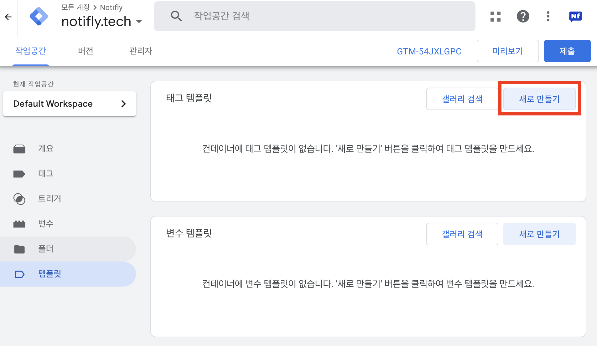
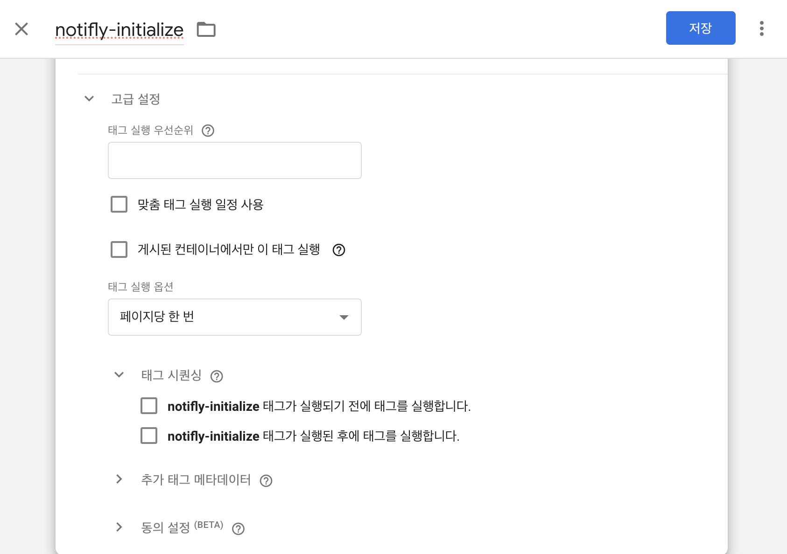
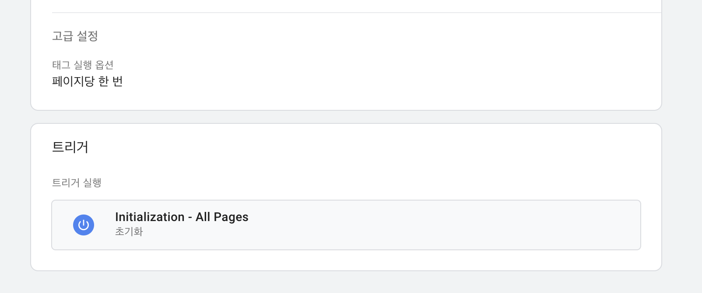
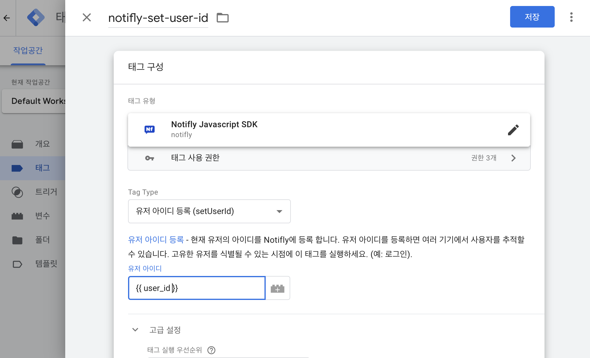
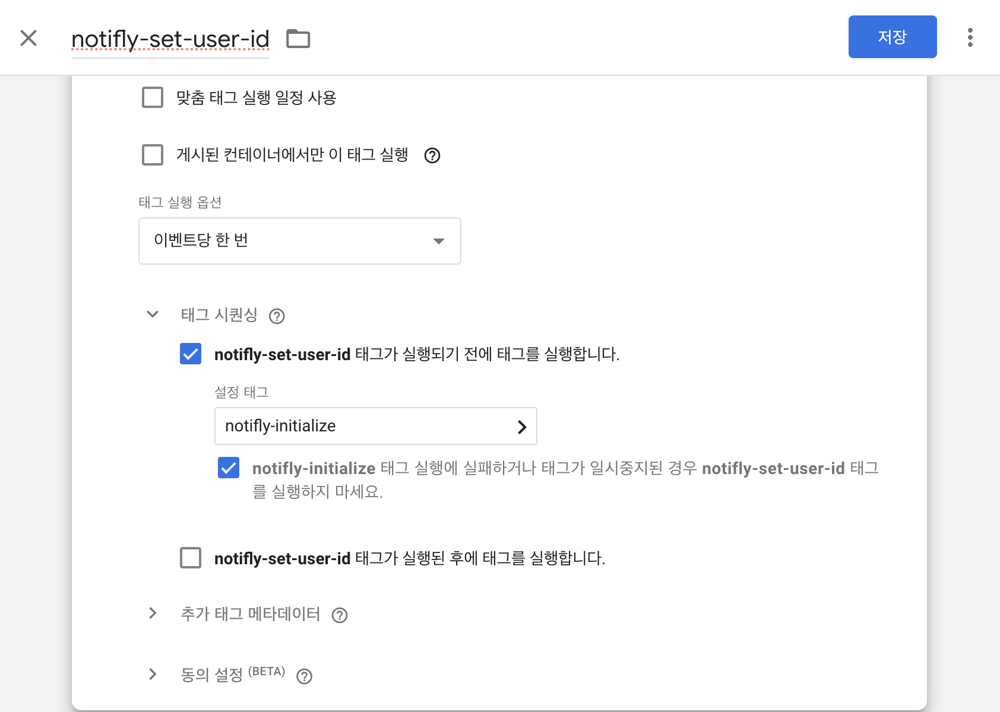
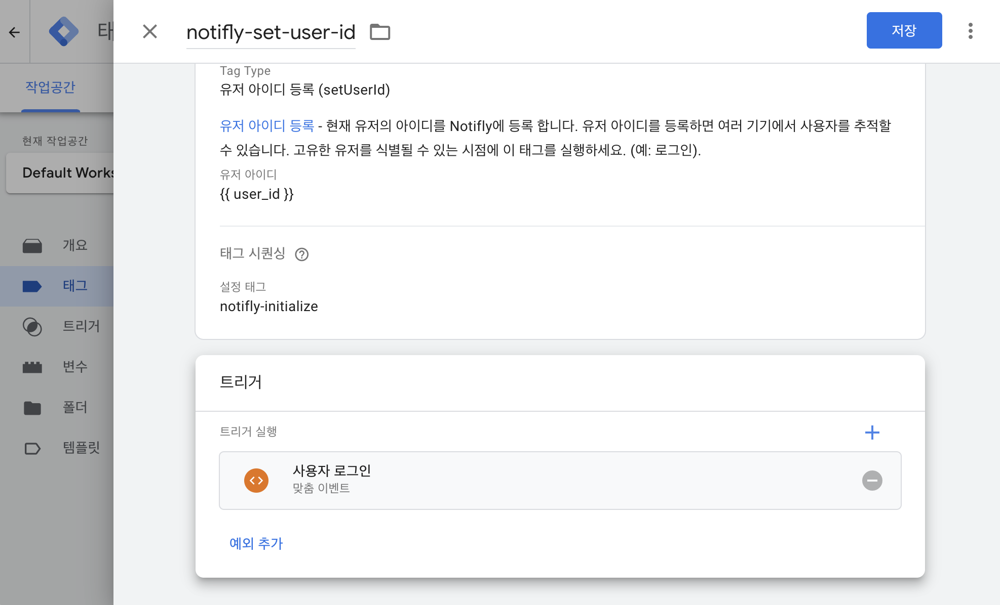
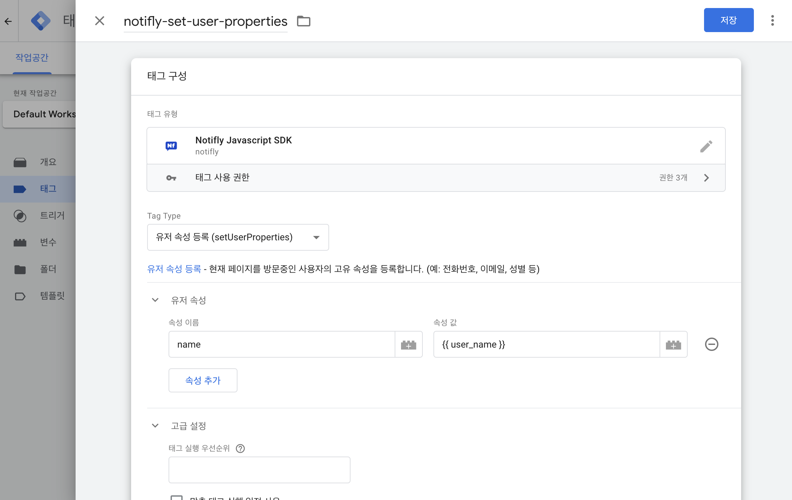
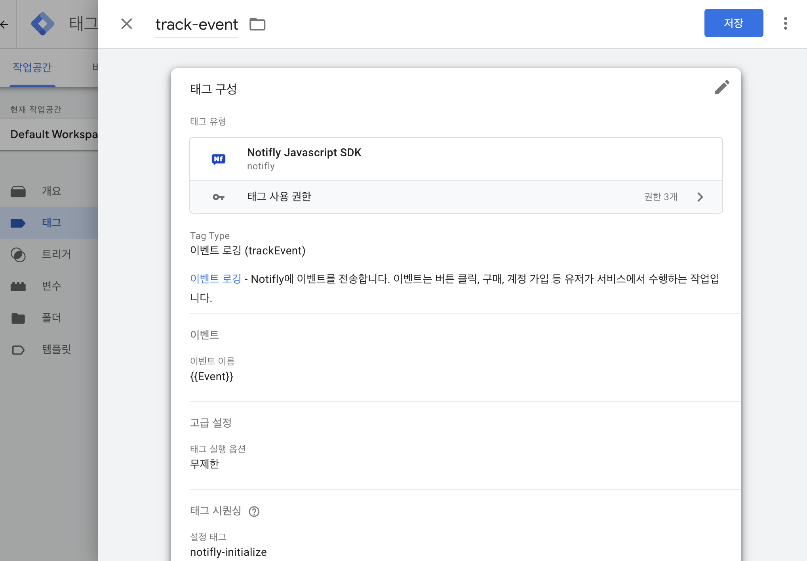
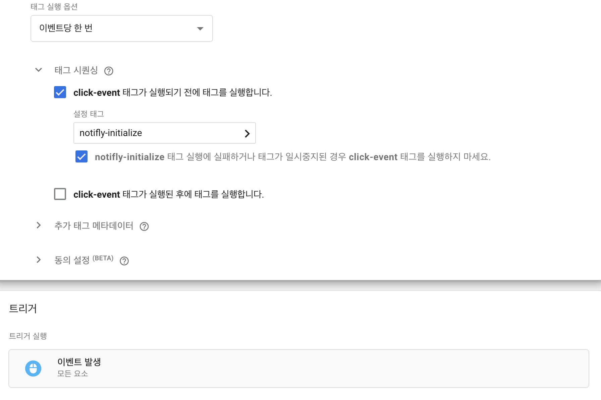

Google Tag Manager(GTM)에 Notifly 맞춤 템플릿을 추가해 코드 수정 없이 손쉽게 SDK 초기화, 사용자/이벤트 연동을 설정할 수 있습니다.

## 1. Notifly 맞춤 템플릿 설치

1. 최신 템플릿 다운로드
[릴리스 페이지](https://github.com/team-michael/notifly-gtm-template/releases)에서 템플릿을 내려받습니다.
   - 한글: **template.ko.tpl**
   - 영문: **template.tpl**
2. GTM 좌측 하단 템플릿 메뉴로 이동 → 우측 상단 태그 템플릿 > 새로 만들기 클릭
   
3. 템플릿 편집기 우측 상단 ⋮ > 가져오기 선택 → 내려받은 .tpl 파일을 가져옵니다.
   
4. 저장을 클릭하면 좌측 하단에 템플릿이 생성됨 팝업이 표시되고 설치가 완료됩니다.
   

## 2. Notifly SDK 초기화 태그

1. Google Tag Manager 좌측 태그 메뉴 → 새로 만들기
2. 태그 이름 지정 → 태그 구성 클릭
3. 맞춤 템플릿 섹션에서 Notifly JavaScript SDK 선택
   
4. 태그 구성에서 Tag Type: SDK 초기화 선택 후 Project ID, Username, Password 입력. ([Notifly SDK 초기화 옵션](/sdk/javascript-sdk) 참고.)
 
5. 고급 설정 → 태그 실행: 페이지당 한 번 / 트리거: Initialization – All Pages 로 지정.

## 3. 유저 관리

캠페인 타깃팅/개인화를 위해 `userId`와 `userProperties`를 설정합니다. 푸시 수신 동의 등도 `userProperties`에 저장해 필터링할 수 있습니다.

<Info>
반드시 **SDK 초기화 태그**가 선행되어야 합니다.
</Info>

:::

### 3-1. 유저 아이디 등록 (setUserId)

1. 태그 > 새로 만들기 → 태그 이름(예: Notifly – setUserId) 지정 → 태그 구성 클릭. 
2. Tag Type: 유저 아이디 등록 (setUserId) 선택 후, 유저 아이디 입력란에 [GTM 변수](https://support.google.com/tagmanager/answer/7683362)(예: `{{User ID}}`)를 지정.   

3. 태그 시퀀싱에서 SDK 초기화 태그를 먼저 실행하도록 설정. **(초기화 태그가 실행되지 않으면 다른 태그들이 동작하지 않습니다.)**
   

4. 트리거는 로그인 완료 시점의 맞춤 이벤트(예: login_success)를 사용.
   

### 3-2. 유저 속성 등록 (setUserProperties)

1. 태그 > 새로 만들기 → 태그 이름(예: Notifly – setUserProperties) 지정 → 태그 구성.

2. Tag Type: 유저 속성 등록 (setUserProperties) 선택 → 등록할 속성에 대응하는 [GTM 변수들](https://support.google.com/tagmanager/answer/7683362)을 매핑.

3. 태그 시퀀싱에서 `setUserId` → `setUserProperties` 순서가 되도록 구성.

<Info> 
- 이메일 발송에는 **`$email`**, 카카오 알림톡/친구톡/문자 발송에는 **`$phone_number`** 예약 키가 필요합니다. 
- 예약 키는 반드시 표기 그대로 사용하세요. 예: `$email`, `$phone_number` 
</Info>

<Warning>
`setUserId(null)`을 호출하면 해당 유저의 프로퍼티, 캠페인 히스토리, 피로도 데이터가 **모두 삭제됩니다.**  
로그아웃 시점에만 호출하세요.
</Warning>

## 4. 이벤트 로깅 (trackEvent)

사용자 행동(클릭, 조회, 구매 등)을 이벤트로 전송해 세그먼트/트리거/성과 분석에 활용합니다.
<Info> 
- 반드시 **SDK 초기화 태그 실행 후** 동작하도록 태그 시퀀싱을 설정하세요. 
- **유저 세그먼트 이벤트 변수 목록**(segmentationEventParamKeys)에 **최대 1개의 키**만 지정 가능합니다. 
</Info>

1. 태그 > 새로 만들기 → 태그 이름(예: Notifly – trackEvent) 지정 → 태그 구성.
2. Tag Type: 이벤트 로깅 (trackEvent) 선택 → 이벤트 이름 입력 → 필요 시 이벤트 파라미터(GTM 변수 매핑)와 세그먼트 이벤트 변수 목록 지정.

3. 태그 시퀀싱에서 SDK 초기화 태그 이후에 실행되도록 구성.
4. 예시: GTM에서 제공하는 **[기본 변수](https://support.google.com/tagmanager/answer/7182738) `클릭 ID`와 [기본 트리거 이벤트](https://support.google.com/tagmanager/answer/7679320) `클릭 - 모든 요소`를 사용해 클릭 요소의 `id`를 `element_id`로 전송하고, 이를 세그먼트 이벤트 변수 목록에 추가.
   
   

## 5. 연동 테스트

- 설정이 완료되면 Notifly 콘솔에서 사용자/속성/이벤트 수신 여부를 점검하세요.
- 추가 점검은은 [연동테스트](integration-test) 문서를 참고하세요.

## (심화) 웹 푸시 설정

- Web Push사용을 위해서는 Google Tag Manager 설정 이외에, 웹사이트에 스크립트를 추가해주셔야 합니다.
- [Javascript SDK 가이드의 웹 푸시 설정 섹션](/ko/developer-guide/client-sdk/javascript-sdk#web-push)을 참고하여 사이트에 `notifly-service-worker.js` 파일을 추가해주세요.
- 연동 관련 문의 사항은 contact@notifly.tech 으로 이메일 부탁드립니다. 
