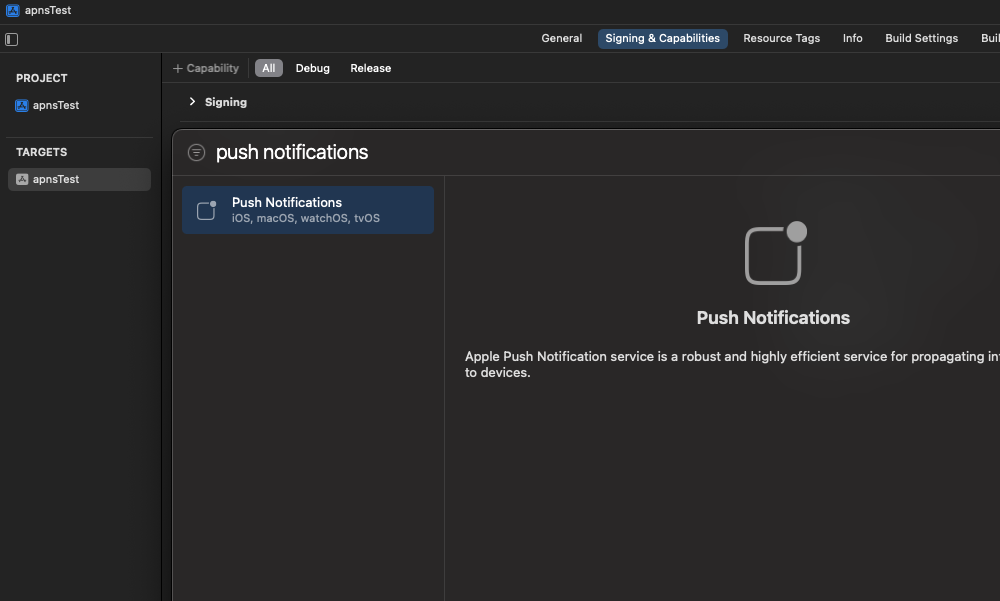
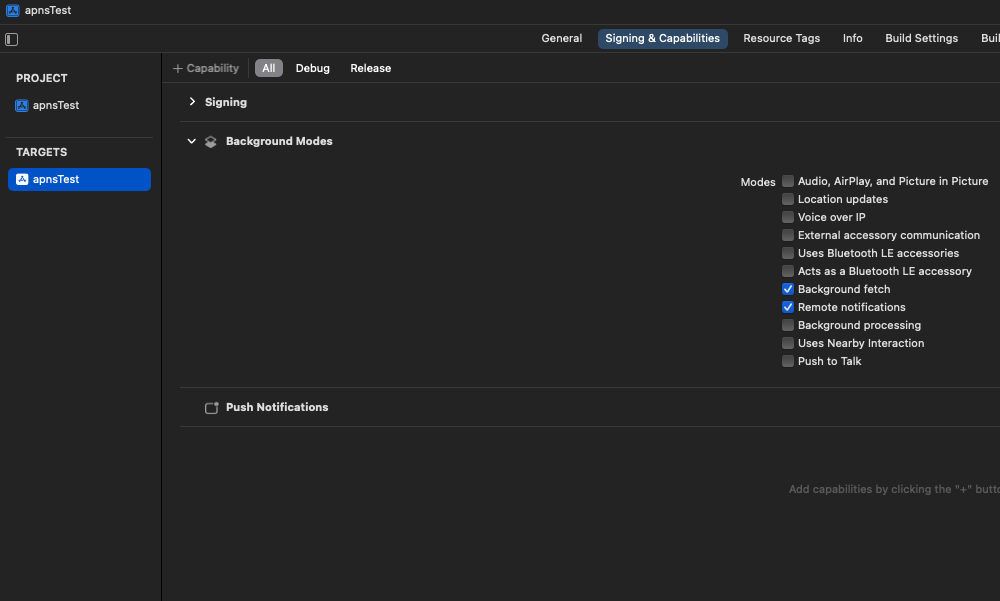

Notifly iOS SDK는 iOS 애플리케이션에 노티플라이 서비스를 연동하기 위한 SDK입니다.  
다음 기능을 지원합니다:

- 기기 정보를 등록해 앱 푸시 및 인앱 팝업 수신  
  - 인앱 팝업은 **Foreground 상태에서만** 수신됩니다.  
- 유저 정보 및 이벤트를 노티플라이와 연동하여 **캠페인 세분화 및 성과 분석**에 활용  
- 이벤트 로깅을 통해 캠페인 효과를 추적

## 시작하기 전에

1. **Firebase 프로젝트 연동 완료**  
Notifly iOS SDK는 푸시 발송을 위해 [Firebase Cloud Messaging](https://firebase.google.com/docs/cloud-messaging)을 사용합니다.  
  > 👉 [Firebase 프로젝트 연동 가이드](sdk/firebase-integration)

2. **iOS APNs 인증 등록**  
  > 👉 [APNs 인증서 등록](sdk/firebase-integration#1-3-apns-%EC%9D%B8%EC%A6%9D%EC%84%9C-%EB%93%B1%EB%A1%9D)

--

## 1. iOS 설정

### 1. Capability 설정

1. iOS Deployment Target/Target의 Minimum Deployments을 13.0 이상으로 설정하고, Podfile의 최소 버전도 동일하게 지정합니다.

2. Push Notification 및 Background Mode (Remote notification, Background fetch)를 활성화합니다.
   
   

## 2. iOS SDK 설치

Notifly iOS SDK는 CocoaPods 또는 Swift Package Manager를 통해 설치할 수 있습니다.

<Tabs>
<Tab title="CocoaPods">
1. Xcode 프로젝트에 CocoaPods 설치가 되어있는지 확인합니다.
   설치가 되어있지 않은 경우 [CocoaPods 설치 가이드](https://guides.cocoapods.org/using/getting-started.html)를 참고해 주세요.
2. Podfile 파일의 상단에 **platform :ios, '13.0'** 또는 그 이상의 버전으로 입력해 주세요.
3. Podfile 파일에 다음 코드를 추가해 주세요.

```swift title="Podfile" highlight={3}
target 'YOUR_PROJECT_NAME' do

 pod 'notifly_sdk'

end
```
</Tab>
<Tab title="Swift Package Manager">
1. Xcode 프로젝트에 Swift Package Manager 설치가 되어있는지 확인합니다.
   설치가 되어있지 않은 경우 [Swift Package Manager 설치 가이드](https://developer.apple.com/documentation/xcode/adding_package_dependencies_to_your_app)를 참고해 주세요.
2. Project's Settings > Package Dependencies > + 버튼을 클릭합니다.
3. 다음 URL을 입력하고 Next를 클릭합니다.
   ```
   https://github.com/team-michael/notifly-ios-sdk
   ```
4. Add Package를 클릭합니다.
</Tab>
</Tabs>

## 3. AppDelegate 설정

Notifly SDK가 iOS 알림 시스템과 통신할 수 있도록 AppDelegate 파일을 수정합니다.

### 1. SwiftUI 프로젝트에서 `AppDelegate` 생성

SwiftUI 프로젝트에는 기본적으로 AppDelegate 파일이 없을 수 있습니다.
이 경우, 아래와 같이 생성합니다.

```swift title="AppDelegate.swift"
import UIKit

class AppDelegate: UIResponder, UIApplicationDelegate {
    func application(_ application: UIApplication, didFinishLaunchingWithOptions launchOptions: [UIApplication.LaunchOptionsKey: Any]?) -> Bool {
        return true
    }
}
```

App.swift 파일에는 ` @UIApplicationDelegateAdaptor(AppDelegate.self) var appDelegate`을 추가합니다:

```swift title="<YOUR_PROJECT_NAME>App.swift" highlight={2}
struct <YOUR_PROJECT_NAME>App: App {
    @UIApplicationDelegateAdaptor(AppDelegate.self) var appDelegate
}
```

### 2. Notifly 초기화 및 Delegate 설정

Notifly SDK를 사용하려면 `AppDelegate.swift`에 다음 코드를 추가하세요.

```swift
import notifly_sdk
```

앱 초기화와 APNs 등록을 위해 `AppDelegate.swift`의 `UIApplicationDelegate` 함수 내 Notifly 관련 코드를 추가합니다.

| 함수 이름 | 설명 |
|--------------|------|
| `application(_:didFinishLaunchingWithOptions:)` | Firebase 초기화 및 Notifly SDK 초기화 |
| `application(_:didRegisterForRemoteNotificationsWithDeviceToken:):` | APNs 토큰을 Notifly에 등록 |
| `application(_:didFailToRegisterForRemoteNotificationsWithError:)` | APNs 등록 실패 시 Notifly에 알림 |

<Info> `projectId`, `username`, `password`는 설정 페이지에서 확인할 수 있습니다. </Info>

```swift title="AppDelegate.swift" highlight={8-10, 18-19, 26-27}
import notifly_sdk

class AppDelegate: UIResponder, UIApplicationDelegate {
    func application(_: UIApplication,
                didFinishLaunchingWithOptions _: [UIApplication.LaunchOptionsKey: Any]?) -> Bool {
        /* ...YOUR CODE */

        FirebaseApp.configure() // if you don't configure Firebase SDK yet.
        Notifly.initialize(projectId: "YOUR_PROJECT_NAME", username: "YOUR_USERNAME", password: "YOUR_PASSWORD")
        UNUserNotificationCenter.current().delegate = self
        return true
    }

    func application(_ application: UIApplication,
        didFailToRegisterForRemoteNotificationsWithError error: Error) {
        /* ...YOUR CODE */

        Notifly.application(application,
                            didFailToRegisterForRemoteNotificationsWithError: error)
    }

    func application(_ application: UIApplication,
        didRegisterForRemoteNotificationsWithDeviceToken deviceToken: Data) {
        /* ...YOUR CODE */

        Notifly.application(application,
            didRegisterForRemoteNotificationsWithDeviceToken: deviceToken)
    }

    /* ...YOUR CODE */
}

```

앱 푸시 알림 트래픽을 노티플라이에 전달하기 위해 `UNUserNotificationCenterDelegate` 프로토콜에 다음 코드를 추가합니다.

| 함수 이름 | 설명 |
|--------------|------|
| `userNotificationCenter(_:willPresent:withCompletionHandler:)` | 포그라운드 알림 표시 |
| `userNotificationCenter(_:didReceive:withCompletionHandler:)` | 앱 푸시 알림 클릭 이벤트 전달 |

```swift title="UNUserNotificationCenterDelegate" highlight={14-15, 26-28}
import notifly_sdk

class AppDelegate: UIResponder, UIApplicationDelegate {
    /* ...YOUR CODE */
}

// Extension of AppDelegate conforming to the UNUserNotificationCenterDelegate protocol
extension AppDelegate: UNUserNotificationCenterDelegate {
    func userNotificationCenter(_ notificationCenter: UNUserNotificationCenter,
                                didReceive response: UNNotificationResponse,
                                withCompletionHandler completion: () -> Void) {
        /* ...YOUR CODE */

        Notifly.userNotificationCenter(notificationCenter,
                                    didReceive: response)

        /* ...YOUR CODE */
        completion()
    }

    func userNotificationCenter(_ notificationCenter: UNUserNotificationCenter,
                                willPresent notification: UNNotification,
                                withCompletionHandler completion: (UNNotificationPresentationOptions) -> Void) {
        /* ...YOUR CODE */

        Notifly.userNotificationCenter(notificationCenter,
                                    willPresent: notification,
                                    withCompletionHandler: completion)
    }
}
```

## 4. 유저 정보 등록

Notifly는 유저 식별자(`userId`)와 유저 프로퍼티(`params`)를 기반으로 개인화 마케팅 캠페인을 수행합니다.  
등록된 유저 정보는 세그먼트 분류, 푸시 발송, 이메일 및 카카오 알림톡 등의 타깃팅에 활용됩니다.

### 1. 유저 ID 등록 (`Notifly.setUserId()`)

`userId`는 앱 내부의 로그인 사용자 식별자와 매핑됩니다.  
Notifly는 이 값을 기준으로 사용자 이벤트를 추적하고 캠페인을 개인화합니다.

### Parameters

<ParamField path="userId" type="String">
  로그인 사용자 ID. 로그아웃 시 `nil`로 설정하여 해제
</ParamField>

```js
notifly.setUserId(userId);
```

#### 유저 ID 해제
로그아웃 시에는 `setUserId(null)`을 호출하여 유저 등록을 해제하는 것이 권장됩니다. 이 호출은 현재 기기와 유저 간 연결을 해제합니다.
따라서, 동일한 유저 데이터를 유지하려면 서버 또는 앱 내부에서 별도로 관리해야 합니다.

<Tabs>
<Tab title="iOS">
```swift title="setUserId" highlight={4, 7}
import notifly_sdk

// userId 등록
Notifly.setUserId(userId: "exampleUserId")

// userId 등록 해지
Notifly.setUserId(userId: nil)
```
</Tab>
</Tabs>

### 2. 유저 프로퍼티 등록

`setUserProperties`는 사용자의 속성 정보를 등록합니다.  
이 정보는 **세그먼트 타깃팅**, **메시지 개인화**, **발송 채널 선택** 등에 사용됩니다.

```swift
notifly.setUserProperties(params);
```

### Parameters

<ParamField path="param" type="[String:Any]" required>
  사용자 속성 key-value 쌍. `$email`, `$phone_number` 등 사전 정의된 키 지원
</ParamField>

<Info>
- `$email` : 이메일 캠페인용 주소  
- `$phone_number` : 문자/카카오 캠페인용 전화번호  
- 기타 커스텀 필드: `"plan"`, `"tier"`, `"country"` 등 자유롭게 설정 가능  
</Info>

<Tabs>
<Tab title="iOS">

```swift title="setUserProperties" highlight={9}
import notifly_sdk

let sampleUserProperties = [
    "age": 15,
    "sex": "male",
    "push_allowed": true
] as [String : Any]

Notifly.setUserProperties(userProperties: sampleUserProperties)
```

</Tab>
</Tabs>

## 5. 이벤트 로깅

유저 행동을 기록하여 **캠페인 트리거**, **세그먼트 조건**, **성과 분석** 등에 활용할 수 있습니다.  
예를 들어 버튼 클릭, 페이지 진입, 구매 완료 같은 사용자 행동을 이벤트로 수집합니다.

```swift
Notifly.trackEvent(eventName, eventParams, segmentationEventParamKeys);
```

### Parameters

<ParamField path="eventName" type="String" required>
  이벤트 이름 (예: "ticket_purchase")
</ParamField>
<ParamField path="eventParams" type="[String: Any]">
  이벤트에 대한 추가 속성. (예: "ticket_name": "premium", "duration": 120)
</ParamField>
<ParamField path="segmentationEventParamKeys" type="[String]">
  세그먼트 분류 시 기준으로 사용할 키 목록 (최대 1개까지 지원)
</ParamField>

<Info>
`segmentationEventParamKeys`를 활용하여 이벤트 변수 (eventParams)를 발송 대상 설정 등에 활용할 수 있습니다. **최대 1개의 Key**만 지정할 수 있습니다.
</Info>

<Tabs>
<Tab title="Swift" >

```swift title="trackEvent" highlight={5, 17-25}
import notifly_sdk

...
    Button(action: {
        Notifly.trackEvent(eventName: "click_button_1")
    }) {
    Text("버튼1")
        .padding(5)
        .background(Color.red)
        .foregroundColor(.white)
        .cornerRadius(10)
    }

...

    Button(action: {
        Notifly.trackEvent(
            eventName: "ticket_purchase",
            eventParams: [
                "ticket_name": "exampleTicket",
                "ticket_price": 10000,
                "ticket_purchase_date": "2021-01-01"
            ],
            segmentationEventParamKeys: ["ticket_name"]
        )
    }) {
    Text("티켓 구매하기")
        .padding(5)
        .background(Color.black)
        .foregroundColor(.white)
        .cornerRadius(10)
    }
...
```

</Tab>
</Tabs>

## 6. 내부 유저 ID 확인

`getNotiflyUserId()` 메서드는 노티플라이가 내부적으로 관리하는 고유 User ID를 반환합니다.  
이는 `setUserId()` 로 등록한 사용자 ID와는 **별개의 식별자**이며, 일반적인 상황에서는 사용할 필요가 없습니다.  
다만 외부 CRM 또는 서드파티 서비스와의 연동 과정에서 내부 User ID 값이 필요한 경우 활용할 수 있습니다.

```kotlin
Notifly.getNotiflyUserId(context)
```

## 7. (권장) iOS Notification Service Extension 설정

<Info> `notifly-sdk` 버전 1.3.0 이상부터 지원됩니다. </Info>

Notification Service Extension을 설정하면 리치 푸시(Rich Push) 기능을 사용할 수 있습니다. Notifly의 [Push Extension 가이드](/advanced/rich-push-notification)를 참고해 설정하세요.

#### 주요 기능

1. 푸시 알림에 이미지 및 비디오 첨부 가능
2. 유저의 푸시 수신 여부를 추적하여 캠페인 성과를 세부적으로 분석 가능

<Warning> Notification Service Extension 설정을 하지 않아도 SDK는 정상 동작하지만, 리치 푸시 및 수신 트래킹은 사용할 수 없습니다. </Warning>

## 8. 연동 테스트

SDK 설치 후 아래 페이지에서 실제 이벤트 및 푸시 수신 여부를 테스트하세요.  
👉 [SDK 연동 테스트](integration-test)

## 9. 심화 연동

<div class="card-group doccards-gray">
<Columns cols={3}>

  <Card
    title="푸시 알림 사전 동의"
    icon="bell"
    href="/advanced/push-notification-consent"
  >
  </Card>
  <Card
    title="인앱 팝업 이벤트 리스너"
    icon="megaphone"
    href="/advanced/inapp-popup-event-listener"
  >
  </Card>
  <Card
    title="리치 푸시 알림"
    icon="bell-plus"
    href="/advanced/rich-push-notification"
  >
  </Card>
</Columns>
</div>

## FAQ

<AccordionGroup>
  <Accordion title="이미 Firebase Cloud Messaging을 사용 중인데 어떻게 해야 할까요?">
    Notifly Android SDK는 기존 앱에서 사용하고 있을 수 있는 Firebase Cloud Messaging과 함께 사용하실 수 있습니다.
  </Accordion>

  <Accordion title="SwiftUI를 사용하고 있습니다. 연동 후, 앱 푸시는 작동하는데 인앱 팝업이 작동하지 않는데 무엇이 문제일까요?">
    - Info.plist에 FirebaseAppDelegateProxyEnabled를 NO(BOOL)로 설정해주세요.
    - Firebase 공식 문서에 따르면 특정 문제로 인해 SwiftUI를 사용할 때 FirebaseAppDelegateProxyEnabled를 NO로 설정해야만 정상적으로 작동한다고 합니다.
  </Accordion>
</AccordionGroup>
