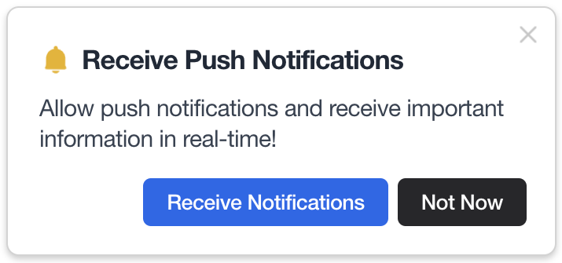

Notifly JavaScript SDK는 **웹 애플리케이션에서 푸시/인앱 캠페인, 유저/이벤트 동기화**를 지원합니다.

## Before You Start

- **Firebase Cloud Messaging(FCM)** 을 사용합니다. 웹 푸시가 필요하다면, 먼저 다음을 준비하세요.
  - VAPID 키 생성: 콘솔 **설정 → SDK 설정 → 웹사이트 설정**에서 생성
  - HTTPS 환경 권장(브라우저 권한 정책)
- 권장 환경: 최신 Chrome/Edge/Safari, ES2017+, 빌드 툴(Webpack/Vite/Rollup 등) 사용 시 **서비스 워커 파일이 번들에 의해 누락되지 않도록** 설정

---

## 1. 설치 & 초기화

웹 환경에 따라 **패키지 설치(npm/yarn/pnpm)** 또는 **CDN 스크립트** 중 하나를 선택하세요.

### 1-1. 설치 (npm/yarn/pnpm)

<Tabs>
<Tab title="npm">

```bash
npm install notifly-js-sdk@latest --save
```

</Tab>
<Tab title="yarn">

```yarn
yarn add notifly-js-sdk@latest
```

</Tab>
<Tab title="pnpm">

```pnpm
pnpm add notifly-js-sdk@latest
```

</Tab>
</Tabs>

<Info>최신 버전 사용을 권장합니다. 성능/보안/기능이 꾸준히 업데이트됩니다.</Info>

### 1-2. 초기화 (v2.5.0 이상)

`projectId`, `username`, `password`만 코드에서 지정합니다. 그 외 웹 푸시 관련 옵션은 콘솔 설정값을 자동 반영합니다.

```JavaScript
import notifly from 'notifly-js-sdk';

useEffect(() => {
  if (typeof window !== 'undefined') {
    notifly.initialize({
      projectId: process.env.NEXT_PUBLIC_NOTIFLY_PROJECT_ID,
      username: process.env.NEXT_PUBLIC_NOTIFLY_PROJECT_USERNAME,
      password: process.env.NEXT_PUBLIC_NOTIFLY_PROJECT_PASSWORD,
    });
  }
}, []);
```

### 1-3. 초기화 (v2.4.0 이하)

웹 푸시를 쓸 경우에만 `pushSubscriptionOptions`를 지정합니다.

```JavaScript
import notifly from 'notifly-js-sdk';

useEffect(() => {
  if (typeof window !== 'undefined') {
    notifly.initialize({
      projectId: '<PROJECT_ID>',
      username: '<USERNAME>',
      password: '<PASSWORD>',
      pushSubscriptionOptions: {
        vapidPublicKey: '<VAPID_PUBLIC_KEY>',
        askPermission: true,
        promptDelayMillis: 5000,
        serviceWorkerPath: '/notifly-service-worker.js',
      },
    });
  }
}, []);
```

### 1-4. CDN 사용

<Tabs> 
<Tab title="IIFE (v2.7.4+ 권장)">

```JavaScript
<script src="https://cdn.jsdelivr.net/npm/notifly-js-sdk@<SDK_VERSION>/dist/index.global.min.js"></script>
<script>
  window.notifly.initialize({
    projectId: "<PROJECT_ID>",
    username: "<USERNAME>",
    password: "<PASSWORD>",
  });
</script>
```
</Tab> 
<Tab title="UMD (v2.5.0+)">

```JavaScript
<script src="https://cdn.jsdelivr.net/npm/notifly-js-sdk@<SDK_VERSION>/dist/index.min.js"></script>
<script>
  window.notifly.initialize({
    projectId: "<PROJECT_ID>",
    username: "<USERNAME>",
    password: "<PASSWORD>",
  });
</script>
```

</Tab> 
<Tab title="UMD (v2.4.0 이하)">

```JavaScript
<script src="https://cdn.jsdelivr.net/npm/notifly-js-sdk@<SDK_VERSION>/dist/index.min.js"></script>
<script>
  window.notifly.initialize({
    projectId: "<PROJECT_ID>",
    username: "<USERNAME>",
    password: "<PASSWORD>",
    pushSubscriptionOptions: {
      vapidPublicKey: "<VAPID_PUBLIC_KEY>",
      askPermission: true
    }
  });
</script>
```
</Tab>
</Tabs> 

<Warning> AMD 로더 사용 시 `<script>`가 충돌할 수 있습니다. **v2.7.4+ IIFE(`index.global.min.js`)** 사용을 권장합니다. </Warning> 
<Warning> SSR/서버 환경에서는 `window`가 없으므로, **`typeof window !== 'undefined'`** 체크 후 초기화하세요. </Warning>

## 2. 웹 푸시 설정

웹 푸시 캠페인을 사용한다면 서비스 워커가 필요합니다.

### 2-1. VAPID 키 생성

콘솔 설정 → SDK 설정 → 웹사이트 설정에서 생성합니다.

### 2-2. Service Worker 파일 만들기

프로젝트 루트(또는 public/)에 `notifly-service-worker.js`를 생성하고 아래 코드를 추가합니다.

```JavaScript
self.importScripts(
  "https://cdn.jsdelivr.net/npm/notifly-js-sdk@2/dist/NotiflyServiceWorker.js"
);
```

<Info> 파일 경로/이름을 바꿨다면, **(v2.4.0 이하만)** 초기화 옵션의 `serviceWorkerPath`를 동일하게 맞추세요. </Info>

<Warning> Webpack/Vite 등 번들러가 **서비스 워커 파일을 복사/서빙**하도록 설정(assets copy 등)을 확인하세요. </Warning>

---

## 3. 권한 요청(웹 푸시)

### 3-1. 기본 동작

콘솔의 “권한 요청 팝업 자동 노출”을 ON하면, 최초 방문 시 안내 팝업 → 브라우저 권한 요청 순서로 표시됩니다.

이미 승인/거부한 경우 브라우저 정책상 재요청되지 않습니다.



### 3-2. 수동 요청 (v2.7.0+)

자동 노출을 OFF로 두고 앱 로직에서 원하는 시점에 호출:

```JavaScript
notifly.requestPermission();      // v2.7.0+
notifly.requestPermission('en');  // v2.8.0+ 언어 강제: ko/en/ja/zh
```

### 3-3. 기본 노출 언어 (v2.8.0+)

브라우저 언어가 미지정/미지원인 경우 사용할 기본 언어는 콘솔에서 설정합니다.

### 3-4. 팝업 커스터마이즈 (v2.7.0+)

콘솔 설정 → SDK 설정 → 웹사이트 설정 → 권한 요청 팝업 디자인 설정에서 UI를 수정/저장합니다. (반영까지 최대 5분)

## 4. 사용자 식별 & 속성

캠페인 타깃팅/개인화를 위해 유저 ID 및 유저 속성을 설정합니다.

### 4-1. 유저 ID 설정

```JavaScript
notifly.setUserId(userId?: string | null);
```

<Tabs>
<Tab title="React">

```TypeScript
const login = (id) => {
  notifly.setUserId(id);
  // 이후 로깅/속성은 새 userId 기준으로 기록됩니다.
};

const logout = () => {
  notifly.setUserId(null); // 등록 해제
};
```
</Tab>
<Tab title="Vanilla JS">

```JavaScript
document.querySelector('#saveId').addEventListener('click', () => {
  window.notifly.setUserId(document.querySelector('#id').value);
});
```
</Tab>
</Tabs>

4-2. 유저 속성 설정

```JavaScript
notifly.setUserProperties(props: Record<string, any>);
```

<Tabs>
<Tab title="React">

```TypeScript
notifly.setUserProperties({
  paid_membership: true,
  $email: "user@example.com",      
  $phone_number: "01012345678", 
});
```
</Tab>
<Tab title="Vanilla JS">

```JavaScript
window.notifly.setUserProperties({ subscribed: true });
```
</Tab>
</Tabs> 

<Info> **예약/표준 속성 키(Reserved Keys)**: `$email`, `$phone_number` 등 채널 발송/개인화에 사용되는 키는 반드시 지정된 이름으로 설정하세요. </Info> <Warning> `setUserId(null)`로 등록 해지 시, 유저 속성/피로도 등 **모든 유저 데이터가 삭제**됩니다. </Warning>

5. 이벤트 로깅

사용자 행동(페이지 진입, 버튼 클릭, 구매 완료 등)을 기록하여 트리거/세그먼트/성과 분석에 활용합니다.

```
notifly.trackEvent(
  eventName: string,
  eventParams?: Record<string, any>,
  segmentationEventParamKeys?: string[] // 최대 1개
);
```
<Tabs>
<Tab title="React">

```TypeScript
// 단순 이벤트
notifly.trackEvent("view_content", { content_name: "mickey_mouse" });

// 세그먼트 키 지정(최대 1개)
notifly.trackEvent(
  "ticket_purchase",
  { show_id: "sample_show_id", performance_start_time: 1674104659 },
  ["show_id"]
);
```
</Tab>
<Tab title="Vanilla JS">

```JavaScript
document.querySelector('#evt').addEventListener('click', () => {
  window.notifly.trackEvent('event1');
});
```
</Tab>
</Tabs> 

<Warning> **호출 순서 중요**: 로그인 등 **userId 변경 직후**에는 `setUserId → setUserProperties → trackEvent` 순서가 가장 안전합니다. </Warning>

## 6. 웹 팝업에서 커스텀 이벤트 로깅 (선택)

웹 팝업 HTML에서 사용자 정의 이벤트를 기록하려면 v2.17.2+ 및 다음 옵션이 필요합니다.

```
notifly.initialize({
  projectId, username, password,
  allowUserSuppliedLogEvent: true, // 커스텀 JS 이벤트 허용
});
```

팝업 템플릿 내 연동 방식은 별도 가이드에 따릅니다. 필요한 경우 노티플라이에 문의하세요.

## 7. 트러블슈팅

서비스 워커 미동작: 파일 경로/이름과 배포 여부, HTTPS, 브라우저 콘솔 에러 확인

권한 팝업 재요청 불가: 브라우저 정책에 따라 거부 후 자동 재표시 불가(사용자 설정에서 직접 변경 필요)

SSR 오류: window 존재 여부 체크 누락

이벤트가 다른 유저로 기록: setUserId 호출 시점 재점검